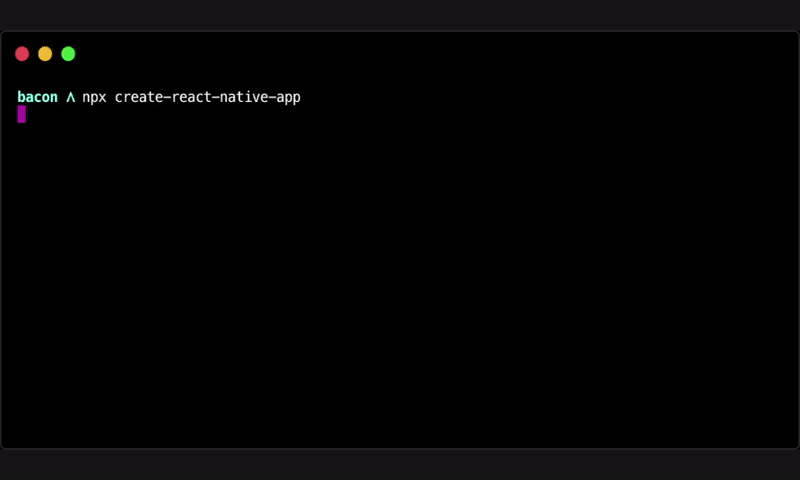

### Já parou pra atualizar em 2022? Aqui vou te ajudar a como iniciar um projeto react native em 2022.

Atualmente existe três formas que eu utilizo para iniciar meus projetos com react-native.
São elas: Por meio do EXPO, React Native CLI e por meio do Create-react-native-app.

##### EXPO

Claro que na documentação do Expo você vai ter tudo completo assim como aqui, porém vamos iniciar esse projeto sendo um projeto aonde ter funcionalidades mais avançadas assim temos que fazer tudo pelo Manangement EXPO. Pois só assim teremos acesso a pasta `Android` ou `IOS`. É nescessário que você tenha a CLI do EXPO instalado. Então o primeiro comando é:

```bash
npm install -g expo
```

Após isso rode o comando:

```bash
expo init nameProject
```

E selecione o BareWorkflow para assim termos um projeto já configurado com o template que queremos. Com isso apenas para ver se está tudo certo rode o comando:

```bash
yarn ios

or

yarn android
```

Se estiver o app irá abrir no emulador ou no seu celular.

##### React Native CLI

Neste caso é recomendado que instale o <a href="https://nodejs.org/en/">NodeJS</a> e <a href="https://openjdk.java.net/projects/jdk/11/">OpenJDK11</a>. Porém se formos instalar via executavél iremos perder muito a questão de versionamento. Com isso o NodeJS sempre instalo via <a href="https://github.com/coreybutler/nvm-windows">NVM - Windows</a>, pois assim conseguimos ter várias versões. Por exemplo, em uma empresa que existe vários projetos é necessário termos isso, pois só assim conseguimos executar as aplicações em diferentes versões do NodeJS.

Também temos outra forma de realizar essas instalações, por meio do <a href="https://chocolatey.org/">Chocolatey</a>. Que também é um gerenciador de pacotes popular dentro do Windows.

Para instalar o que é necessário rode o comando:

```bash
choco install -y nodejs-lts openjdk11
```

Instale também o <a href="https://developer.android.com/studio/index.html">Android Studio</a> coloque todas as variavéis de ambiente do sistema. Que neste caso é necessário para inicializar o emulador. Porém eu utilizei por muito tempo o <a href="https://www.genymotion.com/">Genymotion</a> que também é um excelente emulador, mais leve para computadores com menor nível de configuração.

Para criar uma aplicação é necessário que rode o seguinte comando:

```bash
npx react-native init AwesomeProject
```

Para rodar um projeto customizado com Typescript rode este comando:

```bash
npx react-native init AwesomeTSProject --template react-native-template-typescript
```

Após criar toda a aplicação inicie o emulador via Android Studio, assim quando formos rodar o aplicativo não teremos problemas com reconhecimento do emulador. Apenas para um cuidado.

Após ter inicializado o emulador vá até a pasta aonde está o aplicativo, e rode o comando para dar um start no Bundle:

```bash
npx react-native start
```

Após ele inicializar o Metro Bundler abra um novo terminar e rode o comando:

```bash
npx react-native run-android

or 

npx react-native run-ios
```

Se tudo deu certo você irá ver seu app rodando dentro do emulador e assim você já pode começar seu app.

##### Create-React-Native-App

Este é uma forma mais facil de iniciar seu projeto, ela possui diversos templates já prontas que podem ser utilizados de acordo com o layout ou até mesmo com arquitetura que sua empresa utiliza.

Neste caso é apenas necessário rodar o comando:

```bash
npx create-react-native-app
```

<p align="left">
  
</p>

Para rodar o projeto em si temos diversas formas, seja ela web ou mobile. Para mobile rode o comando:

```bash
yarn ios

or

yarn android
```

Para Web rode o comando

```bash
yarn web
```

E assim temos seu projeto rodando de forma correta e totalmente toooppperr.

E ae? Gostou? Qual você usaria? 
Eu neste caso utilizei todas já e sou bem adpeto para a ultima forma, pois ela já vem configurada com bastante coisas e assim ajuda muito quando temos que iniciar algo do zero. Porém também é legal a empresa que vocês estão criarem modelos e assim deixar isso bem explicado para cada um de seus colaboradores.

Obrigado a todos!!

Referências:

https://github.com/expo/create-react-native-app <br>
https://reactnative.dev/docs/environment-setup

